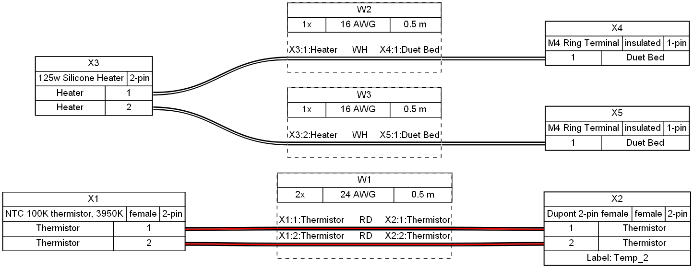
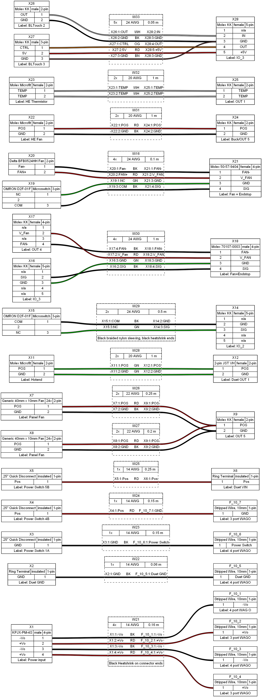

# Wiring
The provided `YAML` files for the RailCore® Mini wiring were created with [WireViz](https://github.com/formatc1702/WireViz).

## Bed Heater Harness

## Main Harness

*RailCore® is a registered trademark of RailCore Labs, LLC.*
